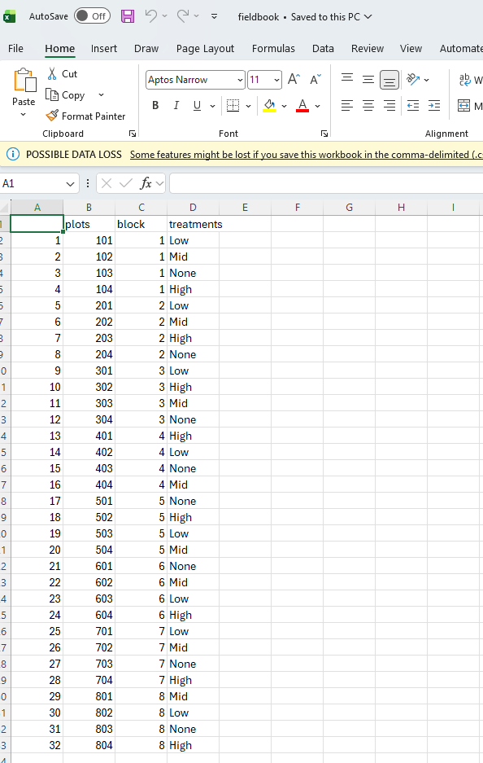

```{r message=FALSE, warning=FALSE}
library(agricolae)
library(dplyr)
library(ggplot2)
```

# 1

# Download ‘10_tomatoes.csv’, a CRD experiment with tomato disease resistance scores

# For this experiment:

# Plot the data using boxplots

# Run an ANOVA and determine if the result is significant

# If it is significant, perform a Tukey test and identify which varieties are significantly different from each other.

```{r}
tomatoes <- read.csv("../data/10_tomatoes.csv")
tomatoes

```

```{r}
boxplot(data = tomatoes, formula(disease ~ variety)) # With R standard functions
```

```{r}
tomanova <- aov(data = tomatoes, disease ~ variety)
summary(tomanova)
```

# The anova is significant

```{r}

tuktomatoes <- HSD.test(tomanova, trt = "variety")
tuktomatoes
```

# Moneymaker is significantly different from Zebra and Brandywine (both designed as group A). Cherokee is not significantly different since it shares both groups.

# 3

# Setup

# 3 different extracts plus a control (=no treatment)

# 20 cages of 6 mice each (=120 total)

# Lots of shelves, each of which can hold up to 5 cages each

# All mice in a cage get the same treatment

# How should you block this experiment?

# How many DOF will you have for treatment, block, and error?

```{r}

treatments <- c("Extract1", "Extract2","Extract3", "None")

n_reps <- 5

rcbd_rats <- design.rcbd(trt = treatments, 
                         r = n_reps,
                         )
rcbd_rats 


# 20 cages with 6 mices = 120 mices. 

# 5 shelves (blocks) of 4 cages, one with each treatment.


```
# I'd use the shelves as blocks and the cages as plots for the treatments. The total observations would be 120, DOF of treatments 4-1 = 3, DOF of blocks 5 - 1 = 4 and error 4 x 3 = 12. Total DOF 20 - 1 = 19.


# The data in “10_olives.csv” contains yield data of olive plants from south Georgia.
#After harvest, it was found that the “Koroneiki” variety was mislabeled (actually a mix of several varieties), so it needs to be removed from the dataset.
# Analyze the remaining varieties and determine which one(s) you should recommend for farmers to plant.


```{r}
olives <- read.csv("../data/10_olives.csv")
olives

```

```{r}
olivesnew <- olives[olives$variety != "Koroneiki", ]
unique(olivesnew$variety)
```

```{r}
model_olives <- aov(oil_yield ~ variety, data = olivesnew)

summary(model_olives)
```

```{r}
tukolives <- HSD.test(model_olives, trt = "variety")
tukolives
```

# 4

# Go back to the blood treatment data from last week (08_platelets.csv).

# Plot the effects of the different treatments and determine which one(s) are significantly better than the control.

# And, if applicable, which one(s) are the best relative to control

```{r}
platelets <- read.csv("../data/08_platelets.csv")
platelets

```

```{r}
model_platelet <- aov(platelet_count ~ variety , data = platelets) # platelets is explained by the column treatment and the data is platelets

summary(model_platelet)
```

```{r}
tukplatelet <- HSD.test(model_platelet, trt = "variety")
tukplatelet
```

```{r}
# With ggplot package.

ploot <- ggplot(platelets, aes(
  x = variety,
  y = platelet_count
)) +
  geom_boxplot(fill = "green") 
ploot

```

# The ANOVA showed that the control and the Protect treatment have no significant difference between both, but are significantly different than the other treatments Vitality and Booster. The median of both control and Protect treatment are simillar suggesting that both can be used for good results. 


# 5

# Using the random seed 456, make an RCBD in R with the following parameters, then print it off to show it worked:

# 4 treatments (Low, Mid, High, and None)

# 8 replicates of each treatment

# Save the fieldbook to an external file and verify it saved correctly.

# “Fieldbook” = 1 plot per row, not the physical layout

# For this experiment, how many DOF did you lose relative to a CRD?

```{r}
set.seed(456)

treatments <- c("Low", "Mid", "High", "None")
n_reps <- 8 # Number of replicates


rcbd <- design.rcbd(
  trt = treatments,
  r = n_reps
)

fieldbook <- rcbd$book

fieldbook
```

```{r}
# write.csv(fieldbook,
#           file = "../output/fieldbook.csv")
```



# DOF
# for treatments we have 4 total treatments so 3 DOF, for blocks, we have 8 blocks, so 7 DOF, and multiplicating treatments with blocks we will have 21 DOF for error. 
# RCBD error df = 21.
# CRD error df = 28.
# RCBD loses 7 error degrees of freedom
# relative to the CRD.
