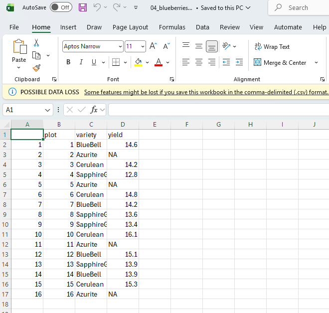

# Exercise 1

## Make a code chunk that calculates the mean of the vector at right.

```{r}
vector <- c(11.2, -4, 6.1, TRUE, 16.2, -6.1)

mean(vector)

```

## Make a second chunk that prints the 12th - 21st letters of the alphabet

```{r}

#matrix[47, 2:7] # Acess What is in row 47, columns 2 7 by 7

letters[12:21] # Remember example in class
```

# Exercise 2

## Make vectors and use R built-in functions to print mean, min ...

```{r}

vector2 <- c(5.4, 17.6, 11.2, 9.4, 6.0)

summary(vector2) # For mean, median, min, max and other parameters summary function is very usefull, since it provides all these analysis.


```

```{r}
#Now for sd and variance we need to use:
sd(vector2)

```

```{r}
var(vector2)
```

# Exercise 3

## Create a vector w/ 0 - 6

```{r}

vector3 <- c(0:6)

```

## How long is this vector

```{r}
length(vector3) #length character will return how many values are inside the vector
```

## What is its class

```{r}
class(vector3)
```

Integers are numbers without decimals, and this is the class of the vector.

## Create a vector 0,7, "Stats" and check class

```{r}
vector32 <- c(0, 7, "Stats")


class(vector32)
```

## Create a vector -1, 4, 7, TRUE, and FALSE

```{r}
vector33 <- c(-1, 4, 7, TRUE, FALSE)

class(vector33)
```

## What are T and F converted to ?

They are converted to numbers 0 and 1.

# Exercise 4

## Create a 2x3 matrix with numbers -3 through 2, filled by column

```{r}
matrix1 <- matrix(c(-3, -2, -1, 0, 1, 2), ncol = 3, nrow = 2)
```

## Create 3x2 matrix with numbers 1 through 6, filled by row

```{r}
matrix2 <- matrix(c(1, 2, 3, 4, 5, 6), ncol = 2, nrow = 3)
```

## Transpose the first matrix and multiply it by the second

```{r}
m1transposed <- t(matrix1)

matrixmult <- m1transposed * matrix2
matrixmult

```

## What happens if you try to multiply without transposing

```{r}
# matrix1 * matrix2
# This option will return Error in matrix1 * matrix2 : non-conformable arrays cause we cannot multiply matrices of different sizes.
```

# Exercise 5

## Creating Vectors

```{r}
A <- c(27, 14, 6)
B <- c(15, 17, -1)
```

## A not equal to 6

```{r}
A != 6
```

## B Positive

```{r}
B > 0
```

## A less than B saving as C

```{r}
C <- A < B # C was created as a Conditional, will be used on next step.
```

## C to print only elements of A that are less than B

```{r}
A[C]
```

# Exercise 6

## Loading dataset, size, and column names

```{r}
df <- PlantGrowth
```

Data Frame with 2 columns and 30 rows, column names are weight and group.

## srt()

```{r}
str(df)
```

This function tells me the dimensions of the data frame, the type of the columns and variation inside the factor columns and some of the values contained on those columns.

## Add year columns with the value 2024

```{r}
df$year <- 2024
head(df,5) #printing first 5 rows.
```

# Exercise 7

## Making df

```{r}
letters = c(letters[1:24])
index = c(-14:9) 

df2 <- data.frame(letters = letters, index = index, offset = offset(1:3))
```

## Print every third letter

```{r}
df2$letters[df2$offset == 3]
```

## Starting at B, print every fourth letter where 0 \< index \< 7
### Hint: You will need to make a new offset key

```{r}
# Sources of help: https://rguides.dev/reference/base-functions/rep/, https://www.statology.org/rep-function-in-r/ .

df2$new_offset <- rep(c(4,1,2,3), length.out = 24) # length.out refers to dataframe size

head(df2, 6)
```

```{r}
df2$letters[df2$new_offset == 1 &
  df2$index > 0 &
  df2$index < 7] # Number where B is located at new_offset, if B was in 2 this would be the number.
```

# Exercise 8

## Read file

```{r}
blueb <- read.csv("../data/04_blueberries.csv")
head(blueb, 5)

```

## Turn yield NA where variety = Azurite

```{r}
blueb$yield[blueb$variety == "Azurite"] = NA

blueb

```

## Write new df into another file and check

```{r}
write.csv(blueb, file = "../output/04_blueberries_out.csv")
```

{width="432"}
