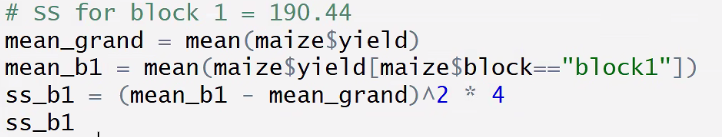

<!-- Review 1 exercise Set your random seed to 123 and make a CRD in R with the following parameters: -->

<!-- 8 treatments (“A” through “H”) -->

<!-- 5 replicates of each treatment -->

<!-- Save your design to a data frame -->

<!-- Add a column “taste” and fill it with random values from a uniform distribution between 0 and 5 -->

```{r Seed to 123, CRD with 5 reps of treatments A-H}

install.packages("agricolae")

library(agricolae)

set.seed(123)
treatments <- LETTERS[1:8]

mydesign <- design.crd(trt = treatments, r = 5)
mydesign$book


# Other way
myreps <- rep(treatments, 5)
crd2 <- sample(myreps, replace = FALSE)

# Make taste column and fill with uniform distribution values 0-5

myframe <- mydesign$book
myframe$taste <- runif(n = nrow(myframe), min = 0, max = 5)
myframe

```

# Anova power to estimate differences - Our power to estimate differences in means realies on how well we can control the noise in our analysis.

# The power in ANOVA largely depends on your error term. The most power out anova we add more reps (Increase DOF), and decrease errors (Be more precisa, use calibrated instruments, or choose better experimentation designs)

# Randomized complete block design (RCBD) - The most common simple design

# Blocks, with complete set of all treatments, and treatments inside blocks are randomized.

# By grouping blocks we reduce error, gaining power in anova, but we lose one DOF per block.


# RCBD is almos aways the better choice.

## Creating:

# Determine your treatments - make your replicates - randomize within blocks

```{r}
treats <- LETTERS[1:5]
n_reps <- 4

# The long way
rep1 = sample(treats, replace = FALSE)
rep2 = sample(treats, replace = FALSE)
rep3 = sample(treats, replace = FALSE)
rep4 = sample(treats, replace = FALSE)

all = c(rep1, rep2, rep3, rep4)
all


# With agricolae
library(agricolae)

rcbd = design.rcbd(
  trt = treats,
  r = n_reps
)

rcbd$book
```

```{r}
library(dplyr)

data(iris)

iris

```

```{r}
# filter function

filter(iris, Sepal.Length  >=5)


```

```{r}
# Select function

select(iris, Petal.Length, Species)
```

```{r}
# Mutate - Adjust a data frame

mutate(iris, Petal.Area = Petal.Length * Petal.Width,
       index = 5, scorer = "Jenny")
```

```{r}
# Summary

summarize(iris, avg_petal_length = mean(Petal.Length),
        max_sepal_width = max(Sepal.Width))

```

```{r}
# Group-by (group inside your data)

iris_group <- group_by(iris, Species)
summarize(iris_group, avg_petal_length = mean(Petal.Length),
        max_sepal_width = max(Sepal.Width))
```

```{r}

```

# Two way ANOVA

```{r}
mydata <- data.frame(plots = 1:6, 
                     blocks = rep(1:3, each=2),
                                  trt= c("A","B","B","A","A","B"),
                                         yield = c(4.5,6.2,8.9,7.7,5.6,6.5))
mydata


# The means

mean_trt <- mydata %>%
  group_by(trt) %>%
  summarize(mean_trt = mean(yield))

mean_trt

```

```{r}
mean_block <- mydata %>%
  group_by(blocks) %>%
  summarize(mean_block = mean(yield))
mean_block

```

```{r}
mean_grand = mean(mydata$yield)
mean_grand
```

```{r}
f_block <- 58.18
f_trt <- 29.47
pf(f_block, df1 = 2, df2 = 2, lower.tail = FALSE)

pf(f_trt, df1 = 1, df2 = 2, lower.tail = FALSE)
```

```{r}
two_way <- read.csv("../data/11_two-way.csv")
two_way

```

```{r}
model_ <- aov(yield ~ block + variety, data = two_way)

summary(model_)
```

```{r}
aov(yield ~ variety, data = two_way) %>%
  summary()
```

# We got more degrees of freedom for error, but we got more error (lost error control), which is a trade-off for the ANOVA to lose power.

# If blocks are not significant, we can just drop them.

```{r}
library(agricolae)

agricol <- HSD.test(model_, trt = "variety")
agricol
```

```{r}
agric <- HSD.test(model_, trt = "block")
agric
```

```{r}

# Ploting data with boxplot common function.

boxplot(data = two_way, yield ~ variety )

```

```{r}
# For this RCBD:
# - 6 varieties → treatment degrees of freedom = \(6-1=5\)
# - 5 reps/blocks → block degrees of freedom = \(5-1=4\)
# - Error degrees of freedom = \((6-1)(5-1)=20\)

# Finding the F-value.

qf(0.98, df1 = 5, df2 = 20) #p-value, df treatment, df error (blocks * treatment)
```

```{r}
maiza <- read.csv("../data/11_maize.csv")
maiza

```

```{r}
new_df <- maiza[maiza$block == "block1",] 
```


